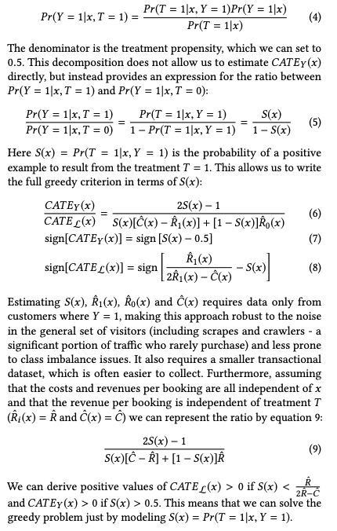
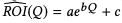

Paper:

"Free Lunch! Retrospective Uplift Modeling for Dynamic
Promotions Recommendation within ROI Constraints"

[Link here](https://sci-hub.https://arxiv.org/pdf/2008.06293v2.pdf/10.1057/jma.2015.5)

- Objectives:
    - Conditional Average Treatment Effect (CATE) of the promotions defined as the conditional increment in probability of completing the purchase _Pr(Y = 1)_ caused by the incentive, given the customer characteristics _x_
    - Current problems: 
        -  High variance in the training dataset, which is heav-
ily dependant on a majority of non-transactional visits having no
intent to purchase
        - Offline solutions might be biased
towards historical data and require dynamic calibration
    - Paper introduces __Retrospective Estimation__, a modeling approach that relies solely on data from positive outcome examples. The key contributions of the paper are:
        -  Optimization framework setup for uplift within ROI constraints
        - Retrospective Estimation technique, relying only on data from positive examples
        - Dynamic model calibration for online applications;
        - Large scale experimental validation
    - Retrospective Estimation technique relies solely on data
from positive outcome examples, which makes its training easier
and more scalable in big-data environments, especially for cases
where only the outcomes’ data is available. 
- Retrospective Estimation Framework
    - 

- Dynamic Calibration Strategy
    -  During an online campaign, the general traffic distribution might differ and therefore, the optimal threshold θ∗ can shift accordingly. 
    - Model the relationship between the portion of the exposed population Qθ and the resulted ROI as an exponential relationship
    - 

    - This model is recalibrated every time period to obtain the threshold for _Dynamically Personalized Treatment_.
