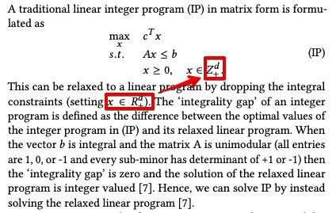
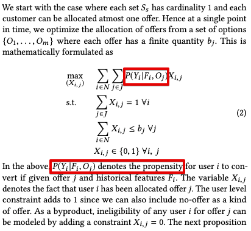
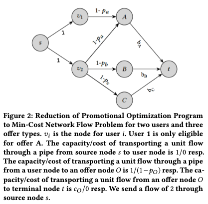

Paper:

"LORE: A large-scale offer recommendation engine through the lens of an online subscription service"

[Link here](https://assets.amazon.science/64/73/c2bd6e5a4597a1732ed1cec5630b/lore-a-large-scale-offer-recommendation-engine-through-the-lens-of-an-online-subscription-service.pdf)

- Objectives:
    - Optimization of recommendation with constraints is usually NP-Hard
    - In the online allocation problem, the goal is to maximize revenue where users arrive in an online manner and the decisions are irrevocable and instantaneous.
    - The paper introduces Min-Cost Flow network optimization, which
enables us to satisfy the constraints within the optimization itself
and solve it in polynomial time. 
- Min Cost Flow Network
    - The Min Cost Flow network is similar to Linear Programming constraints, but instead of solving for integer, the proposal is to change it to real numbers (or the "relaxed" form)
    - 

    - Framing it in the context for uplift modelling for conversion requires propensity modelling
    - 

    - 

- Offline Policy Evaluation
    -  An alternative to A/B testing is offline policy evaluation that can serve as a proof of concept test before deployment
    - Possible methods:
        - Direct Method (DM) Estimator
            - High bias
        - Inverse propensity Score (IPS) Estimator
            - Unbiased estimator but has high variance, especially when the logging policy probability is close to 0
        - Self Normalizing IPS (SNIPS) estimator
            - Controls the variance of the IPS by use of control variates
        - Doubly Robust (DR) Estimator
            - Balances bias and variance
            - Uses the DM method as baseline and applies an IPS based correction whenever the reward data is available (when new and old policy actions match.)