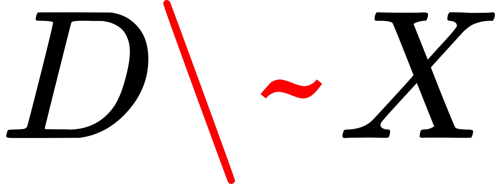

# Uplift Modelling aka Heterogeneous Treatment Effects Evaluation with Criteo Data

##  Why Uplift Modelling / Heterogeneous Treatment Effect Modelling 

With causal inference, we conduct experiments where the treatment assignment is  randomised, and we observe the outcomes (conventionally known as Y) on the experimental units. To calculate the average treatment effect within the whole population, we take the average value of the outcome within the treated group and compare it against the average outcome value within the control group. Since the treatment assignment is randomised, the only difference between both groups is the treatment effect, and we can conclude that the resultant difference is the causal effect of the treatment.

However, we can expect certain subgroups within the general population to experience a greater treatment effect compared to other subgroups. For example, in the context of a medicinal drug used to combat an illness, it is possible that the elderly group (which tends to have a weaker immune system) may have a higher incremental response rate with the drug treatment compared to the young adult group (which tends to have stronger immune system). 

This brings us to the topic of heterogeneous treatment effects (HTE), which implies that different subpopulation groups have varying treatment effects. By identifying that different subgroups will have different response rates to the treatment, we can perform “uplift modelling” to identify and rank the subgroups that have the best response rates and prioritise them. 

## What's uplift modeling? 
Uplift (also known as incremental value) modelling is based on a generic framework using the theory of Conditional Average Treatment Effect (CATE). For a given intervention Treatment T, the incremental value is the difference in expected outcomes between T = 1 and T = 0, conditioned upon some covariates/features X.

<!-- $$
\tau = E[Outcome | Treatment = Yes, Subject's\ Covariates] - E[Outcome | Treatment = No, Subject's\ Covariates]
$$ --> 

The assumptions behind uplift modelling are very similar to what we would in terms of a causal experiment with heterogeneous treatment effect. For a given set of covariates X, we assume conditional independence between the treatment assignment T and the potential outcomes (Y1,Y0). This is also known as the __conditional exchangeability/unfoundedness__ assumption.

<!-- $$
Y^1,\ Y^0\ \perp\ T\ |\ X
$$ --> 

In this article, we will discuss uplift modelling with respect to a business setting where:
- the customers are the experimental units, 
- the customers’ demographic information can be captured by covariates X
- the treatment/intervention T is a business action (e.g. promotion), and 
- the outcome is a binary metric of interest (e.g. customer purchase behaviour) 

Based on the actions taken by customers/subjects with an intervention (e.g. a promotional offer), there is a fundamental segmentation that separates customers into four following groups. 
- The __Persuadables__: Customers who will respond positively because of an intervention. 
- The __Sure Things__: Customers who would responded positively independent of whether they were given an intervention or not. 
- The __Lost Causes__: Customers who respond negatively independent of whether an intervention is given or not. 
- The __Do Not Disturbs__: Customers who will respond negatively if they were given an intervention. 

The objective of any uplift modeling exercise is to identify the __Persuadables__ and prioritise them while avoiding the rest.

## Uplift Modelling with Meta-Learners

There are various approaches through which we can model incremental value. In this article we cover four such techniques:
1. Single Model Approach (S-Learner) [1], 
2. Two Model Approach (T-Learner) [1], 
3. X-Learner [1], and 
4. CATE-generating Outcome Transformation (OT) approach <[2]

All the above formulations can be thought of as algorithmic frameworks to model incremental value, in which one can incorporate any typical machine learning algorithm as a base learner. These algorithmic frameworks are typically referred to as Meta-learners in the literature.

### S-Learner

The S-Learner can be thought of as a “single” model approach. We then model the outcome Y conditional on X AND T (where T is treated as one of the covariates) with the data. The implications of the S Learner is that if the set of X features is very large (or high dimensional), estimating the causal effect of T on Y might be difficult since T is just one out of many covariates. In the following notation, M represents a particular supervised learning model applied on predicting Y conditional on X and T.

<!-- $$
M(Y\ ~\ X,\ T)
$$ --> 

After creating the model, the CATE for a given unit (with its corresponding set of X features) is estimated via:

<!-- $$
\hat{\tau}(X = x) = M(X = x, T = 1) - M(X = x, T = 0)
$$ --> 

### T-Learner
The T-Learner on the other hand uses two models: one for the treated group (represented by M1), and one for the control group (represented by M0). Given that there are separate models for the corresponding groups, the T column is not included as a covariate in the modelling.

<!-- $$
M_1(Y^{T=1}\ ~\ X^{T=1}),\ M_0(Y^{T=0}\ ~\ X^{T=0})
$$ --> 

After creating the two models, the CATE estimation for a given unit (with its corresponding set of X features) is estimated via:

<!-- $$
\hat{\tau}(X = x) = M_1(X = x) - M_0(X = x)
$$ --> 

With the T-Learner, note that there is data inefficiency in the modelling since we only use the treated group data for one model, and the control group data for the other model. To overcome this data inefficiency, we can take a look at the X-Learner.

### X-Learner
The X-Learner consists of two stages each with two models. The two models in the first stage are essentially the same as the two models in the T-Learner. 

<!-- $$
First\ Stage: M_1(Y^{T=1}\ ~\ X^{T=1}),\ M_0(Y^{T=0}\ ~\ X^{T=0})
$$ --> 

Once again, note that M1 was created with the Treated group, while M0 was created using the Control group. After both are created, we can use them to predict the __counterfactual outcomes__ on their corresponding counterpart data group to calculate the intermediate values __D__. 

- For the Control group data, we calculate the intermediate variable DT=0 based on the M1 counterfactual outcome prediction minus the observed outcomes.

<!-- $$
\hat{D}^{0} = M_1(X^{0}) -Y^{0}
$$ --> 

- For the Treated group data, we estimate an intermediate variable DT=1 based on the observed outcome minus the M0 counterfactual outcome prediction.

<!-- $$
\hat{D}^{1} = Y^{1} - M_0(X^{1})
$$ --> 

Thereafter, in the second stage, the two models (M11 and M00) are created using the intermediate values D1 and D0 accordingly:

<!-- $$
M_{11}(\hat{D}^1\ ~ \ X^1),\ M_{00}(\hat{D}^0\ ~ \ X^0)
$$ --> 

Subsequently, the CATE estimation for a given unit (with its corresponding X features) is shown by the following:

<!-- $$
\hat{\tau}(X) = g(x)M_{00}(\hat{D}^0\ ~\ X^0) - (1 - g(x))M_{11}(\hat{D}^1\ ~\ X^1)
$$ --> 

 

Where g(x) is some function and typically created as the propensity scoring model.

## References
1. 
2. 

<!-- $$
D \approx X
$$ --> 

