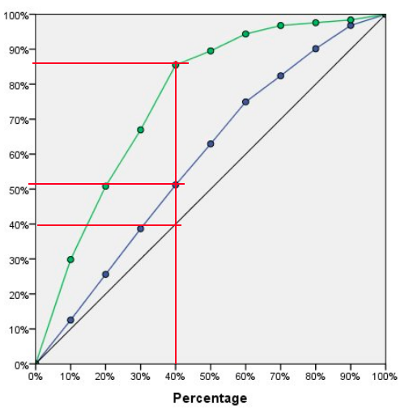

# Uplift Modelling aka Heterogeneous Treatment Effects Evaluation with Criteo Data

##  Why Uplift Modelling / Heterogeneous Treatment Effect Modelling 

With causal inference, we conduct experiments where the treatment assignment is  randomised, and we observe the outcomes (conventionally known as Y) on the experimental units. To calculate the average treatment effect within the whole population, we take the average value of the outcome within the treated group and compare it against the average outcome value within the control group. Since the treatment assignment is randomised, the only difference between both groups is the treatment effect, and we can conclude that the resultant difference is the causal effect of the treatment.

However, we can expect certain subgroups within the general population to experience a greater treatment effect compared to other subgroups. For example, in the context of a medicinal drug used to combat an illness, it is possible that the elderly group (which tends to have a weaker immune system) may have a higher incremental response rate with the drug treatment compared to the young adult group (which tends to have stronger immune system). 

This brings us to the topic of heterogeneous treatment effects (HTE), which implies that different subpopulation groups have varying treatment effects. By identifying that different subgroups will have different response rates to the treatment, we can perform “uplift modelling” to identify and rank the subgroups that have the best response rates and prioritise them. 

## What's uplift modeling? 
Uplift (also known as incremental value) modelling is based on a generic framework using the theory of Conditional Average Treatment Effect (CATE). For a given intervention Treatment T, the incremental value is the difference in expected outcomes between T = 1 and T = 0, conditioned upon some covariates/features X.

<!-- $$
\tau = E[Outcome | Treatment = Yes, Subject's\ Covariates] - E[Outcome | Treatment = No, Subject's\ Covariates]
$$ --> 

The assumptions behind uplift modelling are very similar to what we would in terms of a causal experiment with heterogeneous treatment effect. For a given set of covariates X, we assume conditional independence between the treatment assignment T and the potential outcomes (Y1,Y0). This is also known as the __conditional exchangeability/unfoundedness__ assumption.

<!-- $$
Y^1,\ Y^0\ \perp\ T\ |\ X
$$ --> 

In this article, we will discuss uplift modelling with respect to a business setting where:
- the customers are the experimental units, 
- the customers’ demographic information can be captured by covariates X
- the treatment/intervention T is a business action (e.g. promotion), and 
- the outcome is a binary metric of interest (e.g. customer purchase behaviour) 

Based on the actions taken by customers/subjects with an intervention (e.g. a promotional offer), there is a fundamental segmentation that separates customers into four following groups. 
- The __Persuadables__: Customers who will respond positively because of an intervention. 
- The __Sure Things__: Customers who would responded positively independent of whether they were given an intervention or not. 
- The __Lost Causes__: Customers who respond negatively independent of whether an intervention is given or not. 
- The __Do Not Disturbs__: Customers who will respond negatively if they were given an intervention. 

The objective of any uplift modeling exercise is to identify the __Persuadables__ and prioritise them while avoiding the rest.

## Uplift Modelling with Meta-Learners

There are various approaches through which we can model incremental value. In this article we cover four such techniques:
1. Single Model Approach (S-Learner) [1], 
2. Two Model Approach (T-Learner) [1], 
3. X-Learner [1], and 
4. CATE-generating Outcome Transformation (OT) approach <[2]

All the above formulations can be thought of as algorithmic frameworks to model incremental value, in which one can incorporate any typical machine learning algorithm as a base learner. These algorithmic frameworks are typically referred to as Meta-learners in the literature.

### S-Learner

The S-Learner can be thought of as a “single” model approach. We then model the outcome Y conditional on X AND T (where T is treated as one of the covariates) with the data. The implications of the S Learner is that if the set of X features is very large (or high dimensional), estimating the causal effect of T on Y might be difficult since T is just one out of many covariates. In the following notation, M represents a particular supervised learning model applied on predicting Y conditional on X and T.

<!-- $$
M(Y\ ~\ X,\ T)
$$ --> 

After creating the model, the CATE for a given unit (with its corresponding set of X features) is estimated via:

<!-- $$
\hat{\tau}(X = x) = M(X = x, T = 1) - M(X = x, T = 0)
$$ --> 

### T-Learner
The T-Learner on the other hand uses two models: one for the treated group (represented by M1), and one for the control group (represented by M0). Given that there are separate models for the corresponding groups, the T column is not included as a covariate in the modelling.

<!-- $$
M_1(Y^{T=1}\ ~\ X^{T=1}),\ M_0(Y^{T=0}\ ~\ X^{T=0})
$$ --> 

After creating the two models, the CATE estimation for a given unit (with its corresponding set of X features) is estimated via:

<!-- $$
\hat{\tau}(X = x) = M_1(X = x) - M_0(X = x)
$$ --> 

With the T-Learner, note that there is data inefficiency in the modelling since we only use the treated group data for one model, and the control group data for the other model. To overcome this data inefficiency, we can take a look at the X-Learner.

### X-Learner
The X-Learner consists of two stages each with two models. The two models in the first stage are essentially the same as the two models in the T-Learner. 

<!-- $$
First\ Stage: M_1(Y^{T=1}\ ~\ X^{T=1}),\ M_0(Y^{T=0}\ ~\ X^{T=0})
$$ --> 

Once again, note that M1 was created with the Treated group, while M0 was created using the Control group. After both are created, we can use them to predict the __counterfactual outcomes__ on their corresponding counterpart data group to calculate the intermediate values __D__. 

- For the Control group data, we calculate the intermediate variable DT=0 based on the M1 counterfactual outcome prediction minus the observed outcomes.

<!-- $$
\hat{D}^{0} = M_1(X^{0}) -Y^{0}
$$ --> 

- For the Treated group data, we estimate an intermediate variable DT=1 based on the observed outcome minus the M0 counterfactual outcome prediction.

<!-- $$
\hat{D}^{1} = Y^{1} - M_0(X^{1})
$$ --> 

Thereafter, in the second stage, the two models (M11 and M00) are created using the intermediate values D1 and D0 accordingly:

<!-- $$
Second\ Stage:\ M_{11}(\hat{D}^1\ \sim \ X^1),\ M_{00}(\hat{D}^0\ \sim \ X^0)
$$ --> 

Subsequently, the CATE estimation for a given unit (with its corresponding X features) is shown by the following:

<!-- $$
\hat{\tau}(X) = g(x)M_{00}(X) - (1 - g(x))M_{11}(X)
$$ --> 

Where g(x) is some function and typically created as the propensity scoring model.

### CATE-generating Outcome Transformer (OT) approach

For the OT approach, a key insight is that we can characterize the CATE as a conditional expectation of an observed variable by transforming the outcome using the treatment indicator and the treatment assignment probability. 

The CATE-generating transformation of the outcome is shown by the following formula:

<!-- $$
Y^{*}_{i} = Y^{obs}_{*}.\frac{W_i - e(X_i)}{e(X_i).(1-e(X_i))}
$$ --> 

where:
- __i__ is an indexing on the treated subject, 
- __Yiobs__ is the observed outcome
- __e(Xi)__ is the treatment assignment probability aka propensity score
- __Wi__ is treatment indicator variable

Suppose that the unconfoundedness/conditional exchangeability assumption holds, then

<!-- $$
\mathbb{E}[Y_i^{*} | X_i = x]\ =\ \tau(x)
$$ --> 

For a detailed mathematical proof of the above, please refer to Appendix A1 which has a handwritten breakdown of the mathematical formulation.

## Evaluation Techniques

Evaluation of uplift models involves various metrics. However, before we get into the different metrics, one should understand how to read a gain chart. In the x-axis, we seek to rank the population according to the predicted treatment effects (from highest to lowest typically in a left to right manner along the x-axis.). Thereafter, we can calculate the metric of interest on the y-axis as if we were accumulating more and more of the population quantiles. 

Fig 1: Example Gain Chart

Notably, the typical benchmark for evaluative comparison is a randomised model. This is often represented by the diagonal relatively “straight” line which represents a policy/model that does not discriminate between the subgroups populations (which is represented by the solid black line above). With the lack of prioritisation, the gain effect climbs steadily on average as you increment across the population quantiles.

In the chart above, the green and blue lines show the gain performance for uplift models that have prioritised the population subgroups. For a given population percentage (vertical line at a x-axis value), we can read off the graph to compare the y-values between different models and also against the benchmark value. This difference represents the performance lift, and it can possibly lead to some form of value optimization. For example, as shown by the red line along the green curve, by targeting 40% of the population, one captures about 85% of the possible gain value compared to targeting the whole population.

In uplift modelling, there are 3 common evaluative measures namely:
- Qini curve
- Adjusted Qini curve
- Cumulative Gain curve

### Qini Curve

The Qini Curve is formulated by the following formula:

<!-- $$
Qini(\phi) = \frac{n_{t, y = 1}(\phi)}{N_t} - \frac{n_{c,y=1}(\phi)}{N_c}
$$ --> 

The population fraction ϕ is the fraction of population treated (in either treated t or control c, as indicated by the subscripts) ordered by predicted uplift (from highest to lowest). The numerators represent the count of positive binary outcomes corresponding to either the Treatment group or the Control Group. The denominators (represented by capital N) however do not depend on the population fraction, and are instead the total count of either Treatment or Controls in the experiment. 

Mathematically, the value represents the difference in Positive Outcomes between the Treatment group vs the Control Group for a given population quantile. The bigger the value is, the bigger the treatment effect.

The intuition is that since we ranked the population by descending predicted treatment effects, we would expect the Qini value to be higher at the earliest quantile of the population (where the treatment effect is bigger), and taper off with increasing population quantiles (where the treatment effect is smaller).

### Adjusted Qini Curve

The Adjusted Qini curve is based on the following formula:

<!-- $$
Adjusted\ Qini(\phi) = \frac{n_{t, y = 1}(\phi)}{N_t} - \frac{n_{c,y=1}(\phi)n_t(\phi)}{n_c(\phi)N_t}
$$ --> 

The difference between the Qini curve and the adjusted Qini curve is the fraction for the Control group (represented by the fraction being subtracted). This modified fraction is formulated to represent the fraction value while adjusting for the count of Positive Outcomes in the Control group as if the Total Control Group size was similar to the Total Treatment group size. This is particularly applicable for cases where the treatment group is much smaller compared to the control group in a randomised control trial (where the rationale being that you may not want to expose a potentially harmful treatment to a large proportion of your experimental population). 

### Cumulative Gain Curve

There are different variants of the Cumulative Gain metric, but for this article, the formula is based on the following:

<!-- $$
Cumulative\ Gain(\phi) = \left (\frac{n_{t, y = 1}(\phi)}{n_t(\phi)} - \frac{n_{c,y=1}(\phi)}{n_c(\phi)}\right )\frac{n_t(\phi) + n_c(\phi)}{N_t + N_c}
$$ --> 

The first bracket shows the difference in fractions in the Treatment vs Control groups, whereby the numerators represent the count of Positive Outcomes while the denominator represents the count of Treatment/Control based on a given population.

#### Comparison between Adjusted Qini and Cumulative Gain

The Adjusted Qini Curve can also be reformulated in a different way to illustrate that it is similar to the Cumulative Gain, but with a different multiplier.

<!-- $$
Adjusted\ Qini(\phi) = \frac{n_{t, y = 1}(\phi)}{N_t} - \frac{n_{c,y=1}(\phi)n_t(\phi)}{n_c(\phi)N_t} = \left (\frac{n_{t, y = 1}(\phi)}{n_t(\phi)} - \frac{n_{c,y=1}(\phi)}{n_c(\phi)}\right )\frac{n_t(\phi)}{N_t}
$$ --> 

## Appendix 

### A1

## References
1. 
2. 
